# Anchor Pack v1

This is the first calibration set for mixed graffiti scoring. These anchors are not meant to be "the best art" or "the worst art". They are meant to lock score meaning across sessions and across media.

## How to use this pack

### During human labeling

- Keep this file open while labeling.
- Before each labeling session, look at `2-3` anchors from the same medium you expect to label most.
- If a new image feels close to an anchor, score it near that anchor unless there is a clear reason not to.
- Re-check the anchors every `20-30` labels to avoid drift.
- Do not update anchor scores casually. If an anchor changes, version the pack.

### For teacher-model prompting later

- Use only a small subset in-prompt, not the whole pack.
- Good default: `6` examples total:
  - `3` paper sketches: low, mid, high
  - `3` wall pieces: low, mid, high
- Include the image and its approved JSON scores.
- Keep another set of labeled items out of prompt for evaluation.

### For QA

- After every `50-100` new labels, rerun the audit.
- If new labels drift far from the anchors, pause and recalibrate before continuing.

## Paper sketch anchors

### Low

#### Anchor P1

- file: `33a1b73b-e93c-4273-888f-60e7a116bea2.jpg`
- path: [33a1b73b-e93c-4273-888f-60e7a116bea2.jpg](C:/Users/qwert/Desktop/custom_model/images/33a1b73b-e93c-4273-888f-60e7a116bea2.jpg)
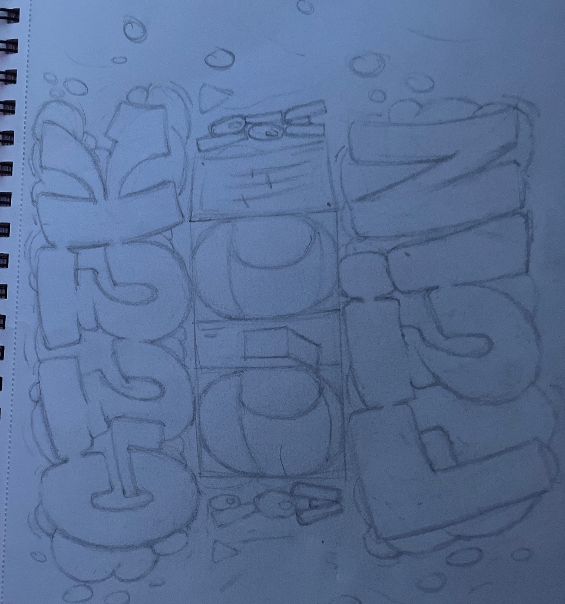
- rationale: very rough sketch with weak finish and weak control
- scores:
  - `legibility: 4`
  - `letter_structure: 2`
  - `line_quality: 1`
  - `composition: 1`
  - `color_harmony: null`
  - `originality: 4`
  - `overall_score: 2`

#### Anchor P2

- file: `1866d8af-4e5d-4886-a3ff-2a1b585b917d.jpg`
- path: [1866d8af-4e5d-4886-a3ff-2a1b585b917d.jpg](C:/Users/qwert/Desktop/custom_model/images/1866d8af-4e5d-4886-a3ff-2a1b585b917d.jpg)
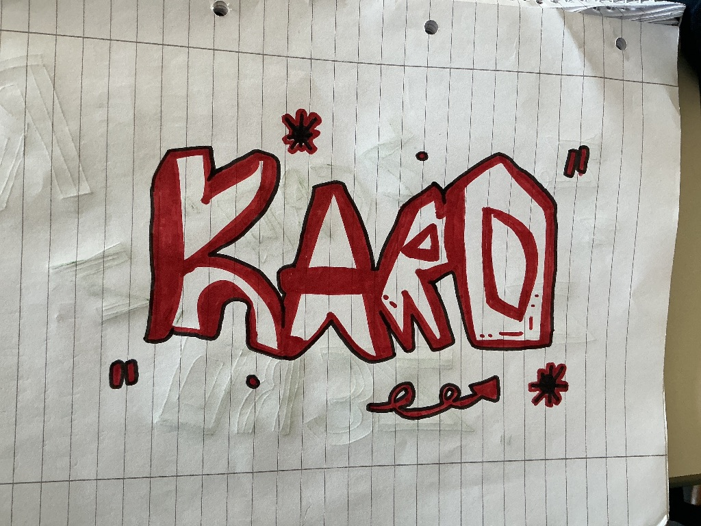
- rationale: readable enough, but structure and execution are still weak
- scores:
  - `legibility: 6`
  - `letter_structure: 2`
  - `line_quality: 2`
  - `composition: 2`
  - `color_harmony: 6`
  - `originality: 2`
  - `overall_score: 3`

### Mid

#### Anchor P3

- file: `0cc59285-bf1a-4021-9eb4-ef772c6f33f6.jpg`
- path: [0cc59285-bf1a-4021-9eb4-ef772c6f33f6.jpg](C:/Users/qwert/Desktop/custom_model/images/0cc59285-bf1a-4021-9eb4-ef772c6f33f6.jpg)
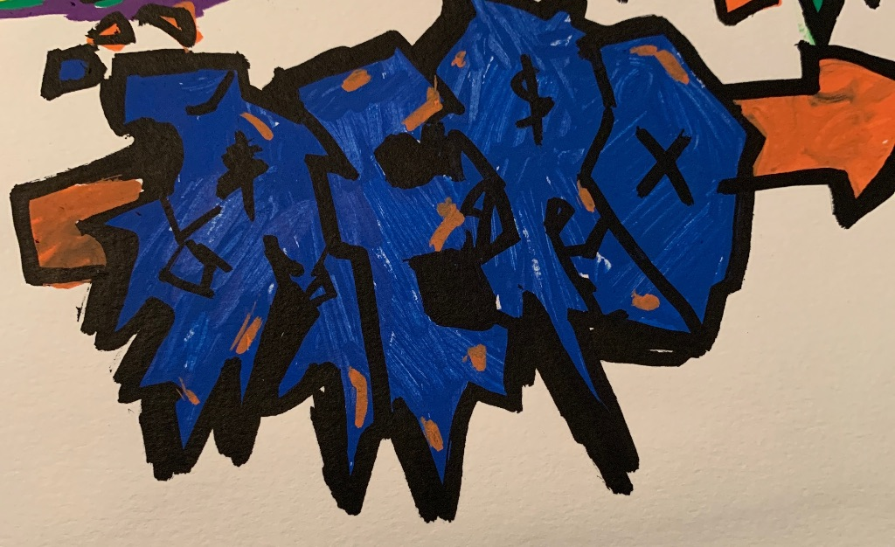
- rationale: readable enough to parse, but still weak in construction and finish
- scores:
  - `legibility: 5`
  - `letter_structure: 2`
  - `line_quality: 2`
  - `composition: 3`
  - `color_harmony: 4`
  - `originality: 4`
  - `overall_score: 3`

#### Anchor P4

- file: `071690cb-68a4-48ff-836f-863675a7c88f.jpg`
- path: [071690cb-68a4-48ff-836f-863675a7c88f.jpg](C:/Users/qwert/Desktop/custom_model/images/071690cb-68a4-48ff-836f-863675a7c88f.jpg)
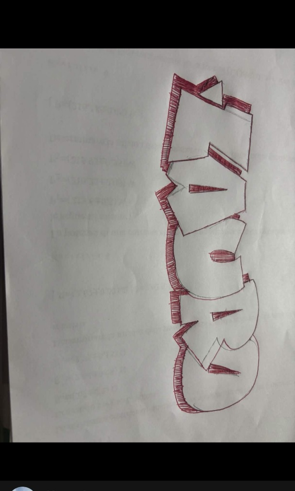
- rationale: readable, but structure, finish, and originality are still weak enough to stay low-mid
- scores:
  - `legibility: 7`
  - `letter_structure: 3`
  - `line_quality: 3`
  - `composition: 3`
  - `color_harmony: 3`
  - `originality: 2`
  - `overall_score: 4`

### High

#### Anchor P5

- file: `497f2701-b215-456e-95ff-89f0fd27126b.jpg`
- path: [497f2701-b215-456e-95ff-89f0fd27126b.jpg](C:/Users/qwert/Desktop/custom_model/images/497f2701-b215-456e-95ff-89f0fd27126b.jpg)
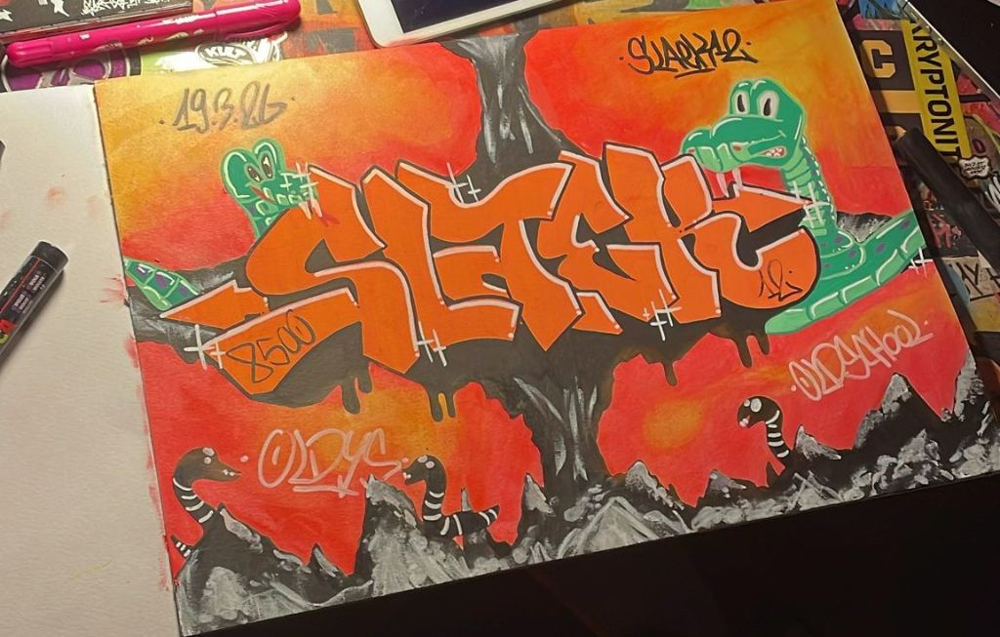
- rationale: high-quality letter-based sketch with strong structure, control, and color use
- scores:
  - `legibility: 8`
  - `letter_structure: 8`
  - `line_quality: 9`
  - `composition: 8`
  - `color_harmony: 9`
  - `originality: 8`
  - `overall_score: 8`

#### Anchor P6

- file: `1976b092-8fe6-4f07-8d2d-8cabe505c6fd.jpg`
- path: [1976b092-8fe6-4f07-8d2d-8cabe505c6fd.jpg](C:/Users/qwert/Desktop/custom_model/images/1976b092-8fe6-4f07-8d2d-8cabe505c6fd.jpg)
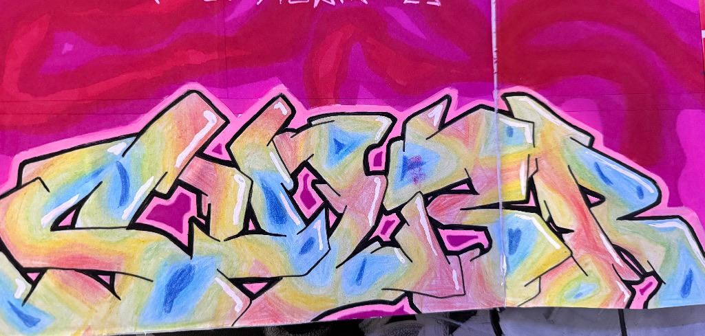
- rationale: high-quality wildstyle sketch with strong structure, control, and color use
- scores:
  - `legibility: 7`
  - `letter_structure: 9`
  - `line_quality: 8`
  - `composition: 8`
  - `color_harmony: 9`
  - `originality: 8`
  - `overall_score: 8`

## Wall piece anchors

### Low

#### Anchor W1

- file: `4acbf5fe-7b90-4761-9f50-8d3b9e9a029a.jpg`
- path: [4acbf5fe-7b90-4761-9f50-8d3b9e9a029a.jpg](C:/Users/qwert/Desktop/custom_model/images/4acbf5fe-7b90-4761-9f50-8d3b9e9a029a.jpg)
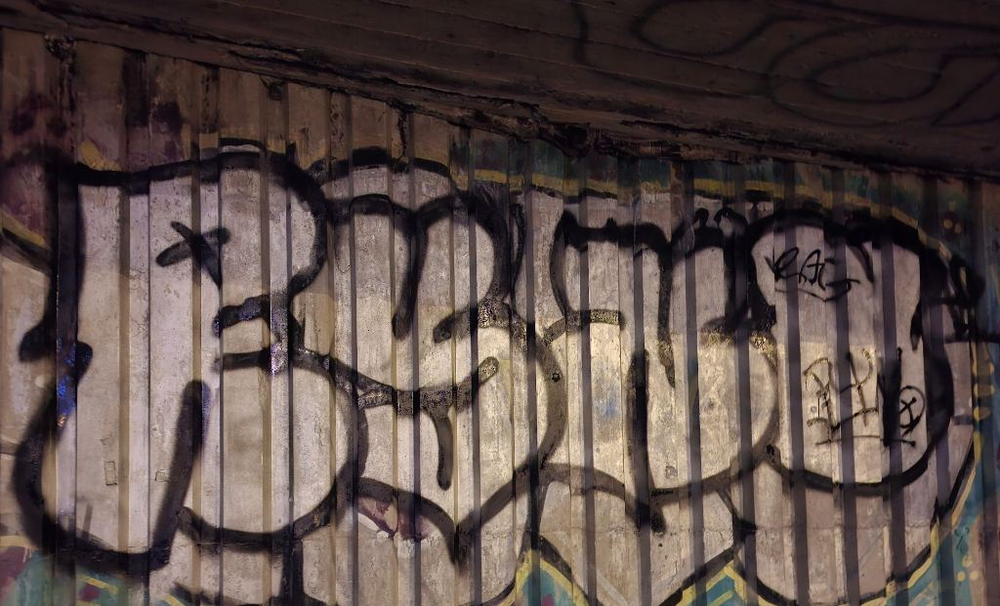
- rationale: basic throwie with weak finish and limited originality
- scores:
  - `legibility: 4`
  - `letter_structure: 3`
  - `line_quality: 4`
  - `composition: 5`
  - `color_harmony: null`
  - `originality: 4`
  - `overall_score: 4`

#### Anchor W2

- file: `1de6cfe5-9efb-44f2-835d-310cdc2808e4.jpg`
- path: [1de6cfe5-9efb-44f2-835d-310cdc2808e4.jpg](C:/Users/qwert/Desktop/custom_model/images/1de6cfe5-9efb-44f2-835d-310cdc2808e4.jpg)
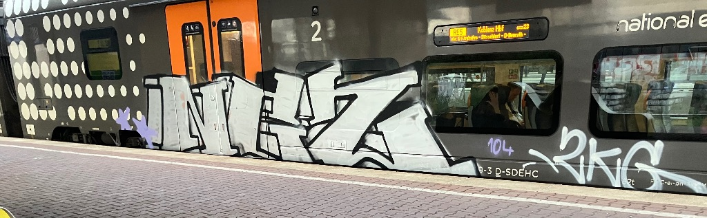
- rationale: readable enough, but weak finish and low execution drag the wall piece down
- scores:
  - `legibility: 7`
  - `letter_structure: 5`
  - `line_quality: 3`
  - `composition: 3`
  - `color_harmony: null`
  - `originality: 3`
  - `overall_score: 4`

### Mid

#### Anchor W3

- file: `13f276a1-ca0d-4f5b-823c-b0d1e8718ab2.jpg`
- path: [13f276a1-ca0d-4f5b-823c-b0d1e8718ab2.jpg](C:/Users/qwert/Desktop/custom_model/images/13f276a1-ca0d-4f5b-823c-b0d1e8718ab2.jpg)
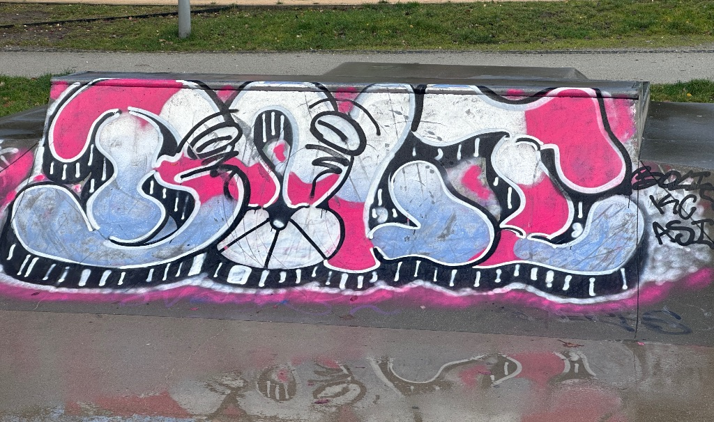
- rationale: decent wall piece with real style effort and solid execution, but not top-tier
- scores:
  - `legibility: 6`
  - `letter_structure: 8`
  - `line_quality: 7`
  - `composition: 7`
  - `color_harmony: 8`
  - `originality: 7`
  - `overall_score: 7`

#### Anchor W4

- file: `46dcc6c2-6eec-4efd-afef-9facbef2cde2.jpg`
- path: [46dcc6c2-6eec-4efd-afef-9facbef2cde2.jpg](C:/Users/qwert/Desktop/custom_model/images/46dcc6c2-6eec-4efd-afef-9facbef2cde2.jpg)
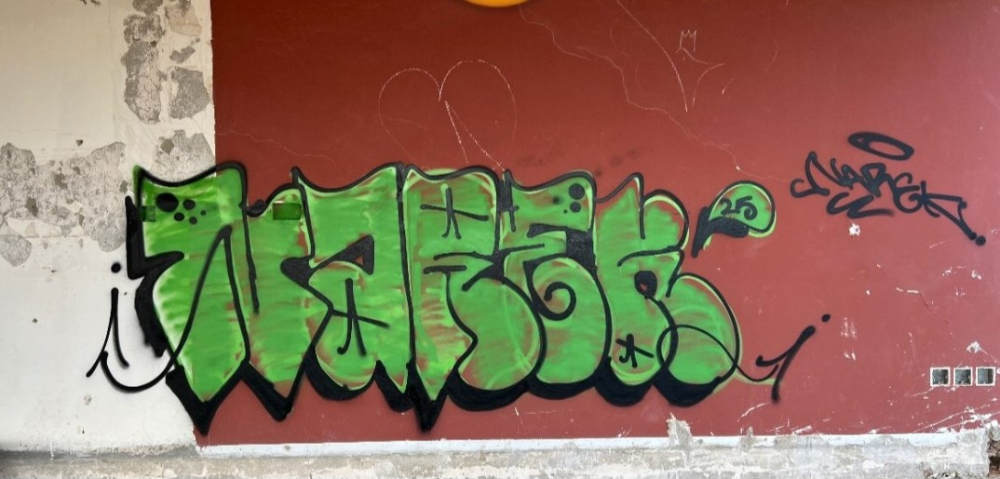
- rationale: competent wall throwie with solid execution and average-to-good design choices
- scores:
  - `legibility: 7`
  - `letter_structure: 6`
  - `line_quality: 7`
  - `composition: 8`
  - `color_harmony: 7`
  - `originality: 7`
  - `overall_score: 7`

### High

#### Anchor W5

- file: `45ee702d-0792-4de8-ace4-60912d62da43.jpg`
- path: [45ee702d-0792-4de8-ace4-60912d62da43.jpg](C:/Users/qwert/Desktop/custom_model/images/45ee702d-0792-4de8-ace4-60912d62da43.jpg)
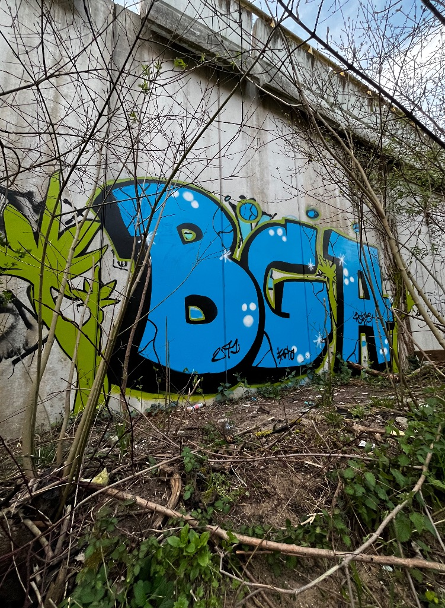
- rationale: strong polished wall piece with high execution and strong readability
- scores:
  - `legibility: 10`
  - `letter_structure: 8`
  - `line_quality: 10`
  - `composition: 7`
  - `color_harmony: 7`
  - `originality: 6`
  - `overall_score: 8`

#### Anchor W6

- file: `0e95a5f5-63d1-4e82-8757-a8aad973d615.jpg`
- path: [0e95a5f5-63d1-4e82-8757-a8aad973d615.jpg](C:/Users/qwert/Desktop/custom_model/images/0e95a5f5-63d1-4e82-8757-a8aad973d615.jpg)
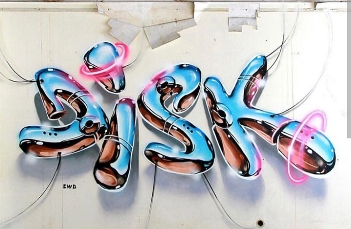
- rationale: top-end wall piece in this batch, exceptional across almost every category
- scores:
  - `legibility: 10`
  - `letter_structure: 10`
  - `line_quality: 10`
  - `composition: 8`
  - `color_harmony: 10`
  - `originality: 10`
  - `overall_score: 10`

## Notes

- Keep `medium` in the dataset even when using these anchors.
- Do not include unusable or out-of-scope items in the anchor pack.
- Replace anchors only when you have a better labeled example for the same score band and medium.
